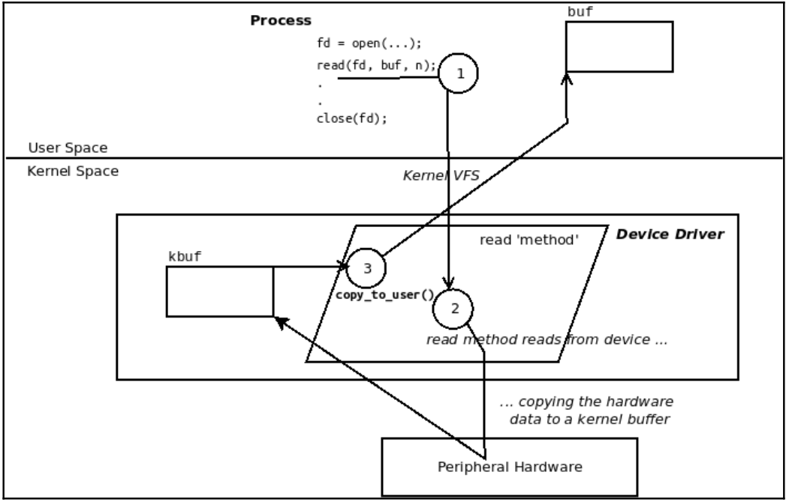

# MISC

- A device driver provides several entry points into kernel called drivers methods.
- We can have open(), read(), write(), llseek(), release() and more.

## Basics
- A device driver is an interface betweeen the OS and peripheral hardware devices.
- It can written inline that is compiled within the kernel image file or written outside the kernel as a kernel module (LKM framework).
- For a user space to access kernel space for device driver within the kernel, some I/O mechanism is required.
- Linux design is to open a special type of file - a device file or device node. (in /dev dir) It acts as an entry point into device driver.
- For distinction between device files for kernel, it uses two attributes within inode data structure:
1. Type of file - either char or block
2. major and minor number


### Block vs Char devices
- Block devices can be mounted and become part of user-accessible filesysmtem. Thus, storage devices used block devices.
- Char devices can't be mounted. Inlcuding I2C/SPi, sensor chips(temp, pressure, humidity), touchscreens, RTC (real time clock), media (video, camera, audio), keyboards, mouse, so on.

### Major and Minor number
- It's pair of 32-bit quantity ihtin inode, a bitmask (dev_t i_rdev member).
- MSB 12 bits are major number(0-4095) and LSB 20 bits are minor number(0-1048575).
- They represent the class of the device (is it a keyboard, terminal, a disk - pseduo hardare devices).
- The driver's interprets the device's minor number to represent either a physical or logical instance of the device.

### Linux Device Model
- It creates a tree unifying system components, all periphereal devices, their drivers.

```
wiki@pi:~$ mount | grep -w sysfs
sysfs on /sys type sysfs (rw,nosuid,nodev,noexec,relatime)
wiki@pi:~$ ls -F /sys/
block/  bus/  class/  dev/  devices/  firmware/  fs/  kernel/  module/  power/
wiki@pi:~$ 
```

- Think of these dirs as viewports into LDM - different ways of viewing the devices on system.
- LDM simply is - Buses, devices on them, device drivers (also known as client drivers).

- Every single device must reside on a BUS.
- USB devices will be on usb bus, PCI devices on PIC bus, I2C devices on I2C bus and more.

```
wiki@pi:~$ ls -F /sys/bus
ac97/       cec/          container/  edac/          genpd/  i2c/       mipi-dsi/  nvmem/         pci_express/  sdio/         soc/  vchiq-bus/
amba/       clockevents/  cpu/        event_source/  gpio/   mdio_bus/  mmc/       nvmem-layout/  platform/     serial/       spi/  workqueue/
auxiliary/  clocksource/  dax/        gadget/        hid/    media/     mmc_rpmb/  pci/           scsi/         serial-base/  usb/
```

- Job of a bus: They organize and recognize the devices on them. If a new devices resurfaces, USB bus driver will recognize and bind to it's device driver.
- Once bounded: many terms are used - bound, enumerated, discovered.
- kernel driver framework invokes the registered probe() method (function) of driver and setups teh device allocating its resources, IRQs, memory setup and more.

Key aspect:
1. Register itself to a kernel framework.
2. Register itself on a BUS.

#### Kernel framework it registers itself to depends on the type of device we work with
- A drive for an RTC chip that resides on I2C bus will register itself to kerne's RTC framework via rtc_register_device() API and to I2C bus via i2c_register_driver() API.
- A driver of NIC on PCI bus will register itself to kernel's network via register_netdev() API and PCI bus via pci_register_drive() API.
- So, registering with a kernel framework is easier as it provides helper routines (and data structures) to take care of I/O details.
- Like we didn't need to know the details of how to communicate with the chip over I2C bus, bit data on Serial Clock/ Serial Data lines as I2C protocol demands.
- Kernel I2C framework provides us with convenience routines as i2c_smbus_*() APIs.
- More details: https://www.kernel.org/doc/html/latest/driver-api/index.html


#### Writing the misc driver code
- We must first register our driver with the appropriate linux kernel framework (here misc framework)
- misc_register() API and include linux/miscdevice.h
```
int misc_register(struct miscdevice *misc) // to register a misc device
void misc_deregister(struct miscdevice *misc) // to de-registe a misc device

struct miscdevice *misc
- a device structure, If the minor number is set to MISC_DYNAMIC_MINOR a minor number is assigned and placed in the minor field of the structure.
- The structure passed is linked into the kernel and may not be destroyed until it has been unregistered. By default, an open() syscall to the device sets file->private_data to point to the structure. Drivers don’t need open in fops for this.

- A zero is returned on success and a negative errno code for failure.
```

#### Connection between process, driver and kernel
- The file_operations structure or fops.
- Majority of members of fops are function pointers (virtual methods).
- They represent all possible file system calls we could issue on a device file.
- Common as open(), read(), write(), poll(), mmap(), release() and more.
- Our job is to populate these function pointers linking them to actual code within the driver.
- More : https://www.kernel.org/doc/html/latest/filesystems/vfs.html#struct-file-operations

```
struct file_operations {
        struct module *owner;
        loff_t (*llseek) (struct file *, loff_t, int);
        ssize_t (*read) (struct file *, char __user *, size_t, loff_t *);
        ssize_t (*write) (struct file *, const char __user *, size_t, loff_t *);
        ssize_t (*read_iter) (struct kiocb *, struct iov_iter *);
        ssize_t (*write_iter) (struct kiocb *, struct iov_iter *);
        int (*iopoll)(struct kiocb *kiocb, bool spin);
        int (*iterate_shared) (struct file *, struct dir_context *);
        __poll_t (*poll) (struct file *, struct poll_table_struct *);
       ...
       ...
       ...
        ssize_t (*copy_file_range)(struct file *, loff_t, struct file *, loff_t, size_t, unsigned int);
        loff_t (*remap_file_range)(struct file *file_in, loff_t pos_in,
                                   struct file *file_out, loff_t pos_out,
                                   loff_t len, unsigned int remap_flags);
        int (*fadvise)(struct file *, loff_t, loff_t, int);
};
```

- Once fops funcitons are setup, once driver is registered with kerrnel when any user space thread or process opens a device file registered to this driver,
the kenel Virtual FileSystem Switch (VFS) takes over.

```
struct device

    The basic device structure

Definition:

struct device {
    struct kobject kobj;
    struct device           *parent;
    struct device_private   *p;
    const char              *init_name;
    const struct device_type *type;
    const struct bus_type   *bus;
    struct device_driver *driver;
    void *platform_data;
    void *driver_data;
    struct mutex            mutex;
    struct dev_links_info   links;
    struct dev_pm_info      power;
    struct dev_pm_domain    *pm_domain;
    ...
    ...
    ...
    struct device_physical_location *physical_location;
    enum device_removable   removable;
    bool offline_disabled:1;
    ...
    ...
    ...
#ifdef CONFIG_DMA_NEED_SYNC;
    bool dma_skip_sync:1;
#endif;
#ifdef CONFIG_IOMMU_DMA;
    bool dma_iommu:1;
#endif;
};
```

### How to write misc driver


#### Output

```
wiki@pi:~/Linux-Kernel-Programming-Part-2/ch1/miscdrv1$ sudo insmod mdriver.ko 
wiki@pi:~/Linux-Kernel-Programming-Part-2/ch1/miscdrv1$ lsmod | grep mdriver.
mdriver                12288  0
wiki@pi:~/Linux-Kernel-Programming-Part-2/ch1/miscdrv1$ sudo dmesg
[  578.482231] mdriver: loading out-of-tree module taints kernel.
[  578.483223] LLKD misc driver (major # 10) registered, minor# = 121, dev node is /dev/driver_miscdrv
[  578.483241] misc driver_miscdrv: sample dev_info(): minor = 121
wiki@pi:~/Linux-Kernel-Programming-Part-2/ch1/miscdrv1$ sudo rmmod mdriver 
wiki@pi:~/Linux-Kernel-Programming-Part-2/ch1/miscdrv1$ sudo dmesg
[  578.482231] mdriver: loading out-of-tree module taints kernel.
[  578.483223] LLKD misc driver (major # 10) registered, minor# = 121, dev node is /dev/driver_miscdrv
[  578.483241] misc driver_miscdrv: sample dev_info(): minor = 121
[  694.656535] LLKD misc driver deregistered, bye
```

```
wiki@pi:~/Linux-Kernel-Programming-Part-2/ch1/miscdrv1$ ls -l /dev/driver_miscdrv 
.Module.symvers.cmd  .mdriver.mod.cmd     .mdriver.o.cmd       Makefile             mdriver.c            mdriver.mod          mdriver.mod.o        modules.order        
.mdriver.ko.cmd      .mdriver.mod.o.cmd   .modules.order.cmd   Module.symvers       mdriver.ko           mdriver.mod.c        mdriver.o            
wiki@pi:~/Linux-Kernel-Programming-Part-2/ch1/miscdrv1$ ls -l /dev/driver_miscdrv 
crw-rw-rw- 1 root root 10, 121 Oct 10 12:17 /dev/driver_miscdrv
wiki@pi:~/Linux-Kernel-Programming-Part-2/ch1/miscdrv1$ 
```

### dd utility to test our driver

- read: dd if=/dev/driver_miscdrv of=readtest bs=4k count=1
- write: dd if=/dev/urandom of=/dev/driver_miscdrv bs=4k count=1

```
This part is reading from driver

wiki@pi:~/Linux-Kernel-Programming-Part-2/ch1/miscdrv1$ dd if=/dev/driver_miscdrv of=readtest bs=4k count=1
1+0 records in
1+0 records out
4096 bytes (4.1 kB, 4.0 KiB) copied, 0.000199004 s, 20.6 MB/s
wiki@pi:~/Linux-Kernel-Programming-Part-2/ch1/miscdrv1$ sud dmesg
Command 'sud' not found, but there are 17 similar ones.
wiki@pi:~/Linux-Kernel-Programming-Part-2/ch1/miscdrv1$ sudo dmesg
[ 1303.777224] LLKD misc driver (major # 10) registered, minor# = 121, dev node is /dev/driver_miscdrv
[ 1303.777249] misc driver_miscdrv: sample dev_info(): minor = 121
[ 1329.742936] Opening "/dev/driver_miscdrv" nowl wrt open file: f_flags = 0x20000
[ 1329.743185] to read 4096 bytes
[ 1329.743276] Closing "/dev/driver_miscdrv"
wiki@pi:~/Linux-Kernel-Programming-Part-2/ch1/miscdrv1$ ls 
wiki@pi:~/Linux-Kernel-Programming-Part-2/ch1/miscdrv1$ hexdump readtest 
0000000 0000 0000 0000 0000 0000 0000 0000 0000
*
0001000
$

This part is for write into driver

wiki@pi:~/Linux-Kernel-Programming-Part-2/ch1/miscdrv1$ ls
Makefile  Module.symvers  mdriver.c  mdriver.ko  mdriver.mod  mdriver.mod.c  mdriver.mod.o  mdriver.o  modules.order  readtest
wiki@pi:~/Linux-Kernel-Programming-Part-2/ch1/miscdrv1$ dd if=/dev/urandom of=/dev/driver_miscdrv bs=4k count=1
1+0 records in
1+0 records out
4096 bytes (4.1 kB, 4.0 KiB) copied, 0.000220703 s, 18.6 MB/s
wiki@pi:~/Linux-Kernel-Programming-Part-2/ch1/miscdrv1$ sudo dmesg
[ 1303.777224] LLKD misc driver (major # 10) registered, minor# = 121, dev node is /dev/driver_miscdrv
[ 1478.671966] Opening "/dev/driver_miscdrv" nowl wrt open file: f_flags = 0x20241
[ 1478.672149] to write 4096 bytes
[ 1478.672172] Closing "/dev/driver_miscdrv"
wiki@pi:~/Linux-Kernel-Programming-Part-2/ch1/miscdrv1$ 
```

### Copying data from kernel to user space and vice-versa
- A primary job of the device driver is to enable user space applications to transparently both read and write data to peripheral hardware device (chip or doesn't have to be hardware),
treating device as a simple regular file.
- To read data from device, application opens the device file corressponding to that device, thus obtaining a file descriptor (fd) then issues read sys call using fd.

#### Kernel APIs to perform data transfer
- Assume your driver has read in hardware data and it's now present in a kernel memory buffer. How do we transfer it to user space ?
- Simple approach: Use memcpy() but no, it's insecure + arch-dependent.
- Kernel provides a couple of inline functinos copy_to_user() and copy_from_user().

```
include linux/uaccess.h

unsigned long copy_to_user(void __user *to, const void *from, unsigned long n)
unsigned long copt_from_user(void *to, const void __user *from, unsigned long n)

Both take 3 params: to (pointer desination buffer), from (pointer source buffer) and n (number of bytes to copy)

return value is number of uncopied bytes. 0 means success and non-zero means number of bytes not copied (0/-E convention)
return an error indicating an I/O fault returning -EIO or -EFAULT (which sets errno in user space to positive counterpart).
```



https://stackoverflow.com/questions/14970698/copy-to-user-vs-memcpy


### Writing misc driver, interacting kernel and user space (2 methods to check)

- Our test_driver is reading and writing into the user space and from the user space via our kernel space read and write for test_driver.
- dmesg shows while reading and writing.

### we could just use dd utility for read and write
- read: dd if=/dev/test_driver of=readtest bs=4k count=1
- hexdump readtest
- cat readtest

- echo "Time is illusion!" > inputfile
- write: dd if=inputfile of=/dev/test_driver bs=4k count=1
- read again: dd if=/dev/test_driver of=readtest bs=4k count=1
- hexdump readtest
- cat readtest

### Using our own user space code

```
wiki@pi:~/Linux-Kernel-Programming-Part-2/ch1/miscdrv_rdwr/test$ ls
Makefile  Module.symvers  mdriver.c  mdriver.ko  mdriver.mod  mdriver.mod.c  mdriver.mod.o  mdriver.o  modules.order  test  user_test.c
wiki@pi:~/Linux-Kernel-Programming-Part-2/ch1/miscdrv_rdwr/test$ sudo dmesg -C
wiki@pi:~/Linux-Kernel-Programming-Part-2/ch1/miscdrv_rdwr/test$ sudo insmod mdriver.ko 
wiki@pi:~/Linux-Kernel-Programming-Part-2/ch1/miscdrv_rdwr/test$ lsmod | grep mdriver
mdriver                16384  0
wiki@pi:~/Linux-Kernel-Programming-Part-2/ch1/miscdrv_rdwr/test$ sudo dmesg
[10214.944966] Test driver with major #10 reg. minor# = 121
                dev node is /dev/test_driver
wiki@pi:~/Linux-Kernel-Programming-Part-2/ch1/miscdrv_rdwr/test$ ./test 
Usage: ./test opt=read/write device_file ["secret-msg"]
 opt = 'r' => we shall issue the read(2), retrieving the 'secret' form the driver
 opt = 'w' => we shall issue the write(2), writing the secret message <secret-msg>
  (max 128 bytes)
wiki@pi:~/Linux-Kernel-Programming-Part-2/ch1/miscdrv_rdwr/test$ ./test r /dev/test_driver 
Device file /dev/test_driver opened (in read-only mode): fd=3
./test: read 12 bytes from /dev/test_driver
The 'secret' is:
 "Hello Prince"
wiki@pi:~/Linux-Kernel-Programming-Part-2/ch1/miscdrv_rdwr/test$ ./test w /dev/test_driver "Time is illusion."
Device file /dev/test_driver opened (in write-only mode): fd=3
./test: wrote 18 bytes to /dev/test_driver
wiki@pi:~/Linux-Kernel-Programming-Part-2/ch1/miscdrv_rdwr/test$ sudo dmesg
[10214.944966] Test driver with major #10 reg. minor# = 121
                dev node is /dev/test_driver
[10245.167024] misc test_driver:  opening /dev/test_driver now, wrt open file: f_flags = 0x20000
[10245.167265] misc test_driver: test wants to read 128 bytes
[10245.167279] misc test_driver:  12 bytes read, returning... (stats: tx=12, rx=0)
[10245.167317] misc test_driver:  filename: "/dev/test_driver"
[10272.388530] misc test_driver:  opening /dev/test_driver now, wrt open file: f_flags = 0x20001
[10272.388791] misc test_driver: test wants to write 18 bytes
[10272.388807] misc test_driver:  18 bytes written, returning... (stats: tx=12, rx=18)
[10272.388841] misc test_driver:  filename: "/dev/test_driver"
wiki@pi:~/Linux-Kernel-Programming-Part-2/ch1/miscdrv_rdwr/test$ ./test r /dev/test_driver 
Device file /dev/test_driver opened (in read-only mode): fd=3
./test: read 17 bytes from /dev/test_driver
The 'secret' is:
 "Time is illusion."
wiki@pi:~/Linux-Kernel-Programming-Part-2/ch1/miscdrv_rdwr/test$ sudo dmesg
[10214.944966] Test driver with major #10 reg. minor# = 121
                dev node is /dev/test_driver
[10245.167024] misc test_driver:  opening /dev/test_driver now, wrt open file: f_flags = 0x20000
[10245.167265] misc test_driver: test wants to read 128 bytes
[10245.167279] misc test_driver:  12 bytes read, returning... (stats: tx=12, rx=0)
[10245.167317] misc test_driver:  filename: "/dev/test_driver"
[10272.388530] misc test_driver:  opening /dev/test_driver now, wrt open file: f_flags = 0x20001
[10272.388791] misc test_driver: test wants to write 18 bytes
[10272.388807] misc test_driver:  18 bytes written, returning... (stats: tx=12, rx=18)
[10272.388841] misc test_driver:  filename: "/dev/test_driver"
[10285.572188] misc test_driver:  opening /dev/test_driver now, wrt open file: f_flags = 0x20000
[10285.572511] misc test_driver: test wants to read 128 bytes
[10285.572528] misc test_driver:  17 bytes read, returning... (stats: tx=29, rx=18)
[10285.572572] misc test_driver:  filename: "/dev/test_driver"
wiki@pi:~/Linux-Kernel-Programming-Part-2/ch1/miscdrv_rdwr/test$ sudo rmmod mdriver 
wiki@pi:~/Linux-Kernel-Programming-Part-2/ch1/miscdrv_rdwr/test$ sudo dmesg
[10214.944966] Test driver with major #10 reg. minor# = 121
                dev node is /dev/test_driver
[10245.167024] misc test_driver:  opening /dev/test_driver now, wrt open file: f_flags = 0x20000
[10245.167265] misc test_driver: test wants to read 128 bytes
[10245.167279] misc test_driver:  12 bytes read, returning... (stats: tx=12, rx=0)
[10245.167317] misc test_driver:  filename: "/dev/test_driver"
[10272.388530] misc test_driver:  opening /dev/test_driver now, wrt open file: f_flags = 0x20001
[10272.388791] misc test_driver: test wants to write 18 bytes
[10272.388807] misc test_driver:  18 bytes written, returning... (stats: tx=12, rx=18)
[10272.388841] misc test_driver:  filename: "/dev/test_driver"
[10285.572188] misc test_driver:  opening /dev/test_driver now, wrt open file: f_flags = 0x20000
[10285.572511] misc test_driver: test wants to read 128 bytes
[10285.572528] misc test_driver:  17 bytes read, returning... (stats: tx=29, rx=18)
[10285.572572] misc test_driver:  filename: "/dev/test_driver"
[10305.791340] Driver is de-registered.
wiki@pi:~/Linux-Kernel-Programming-Part-2/ch1/miscdrv_rdwr/test$ 
```


